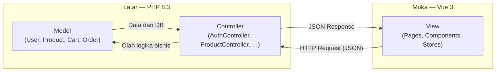
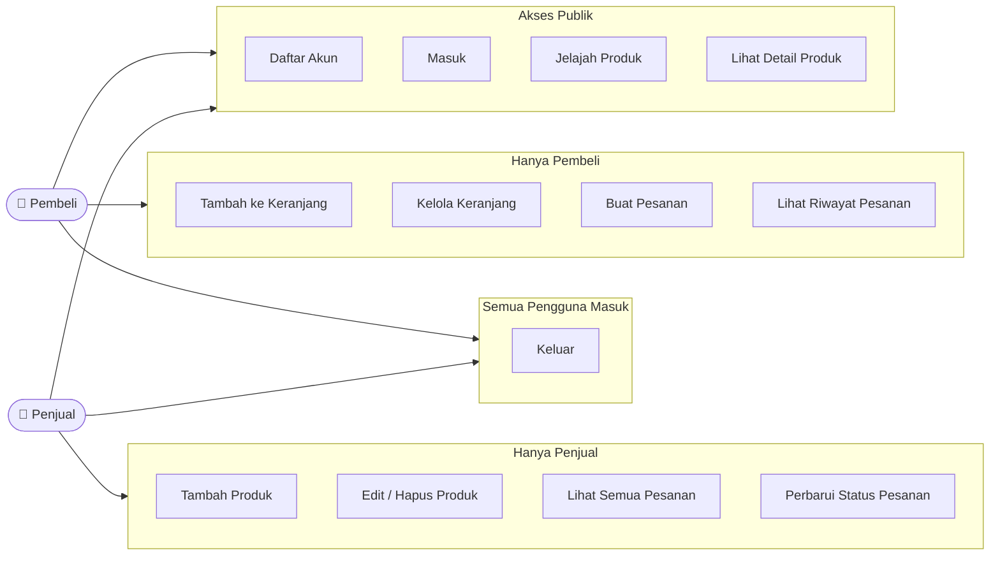
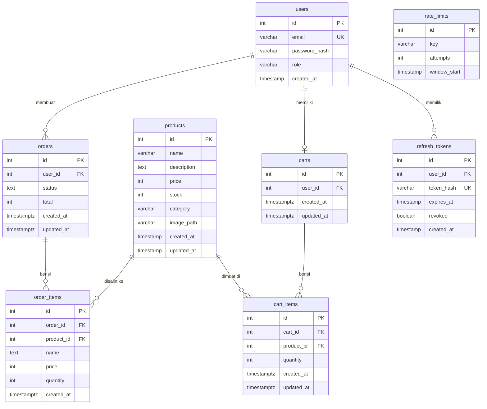
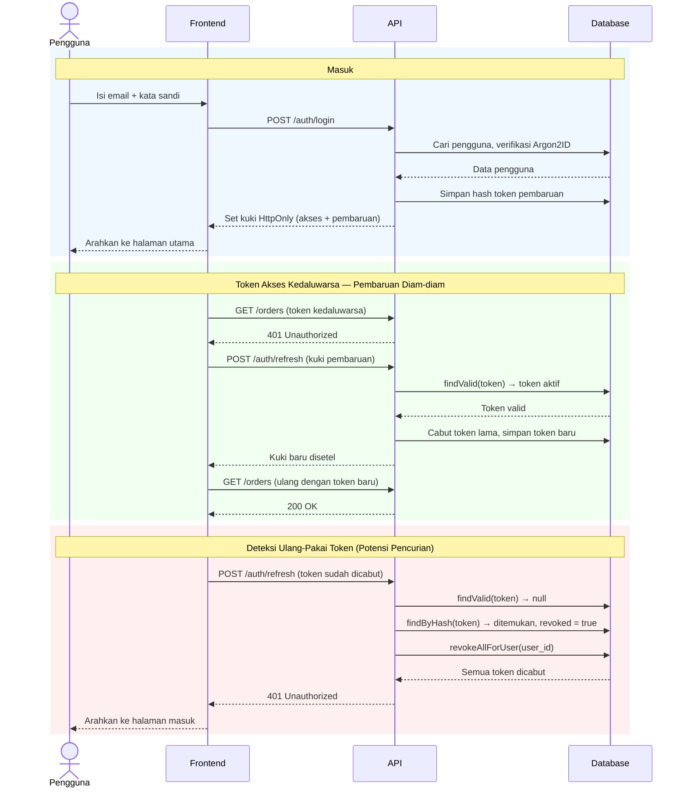
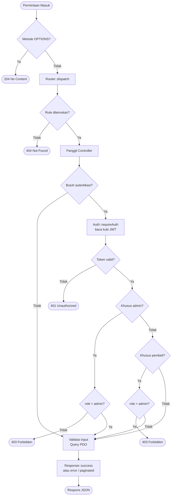
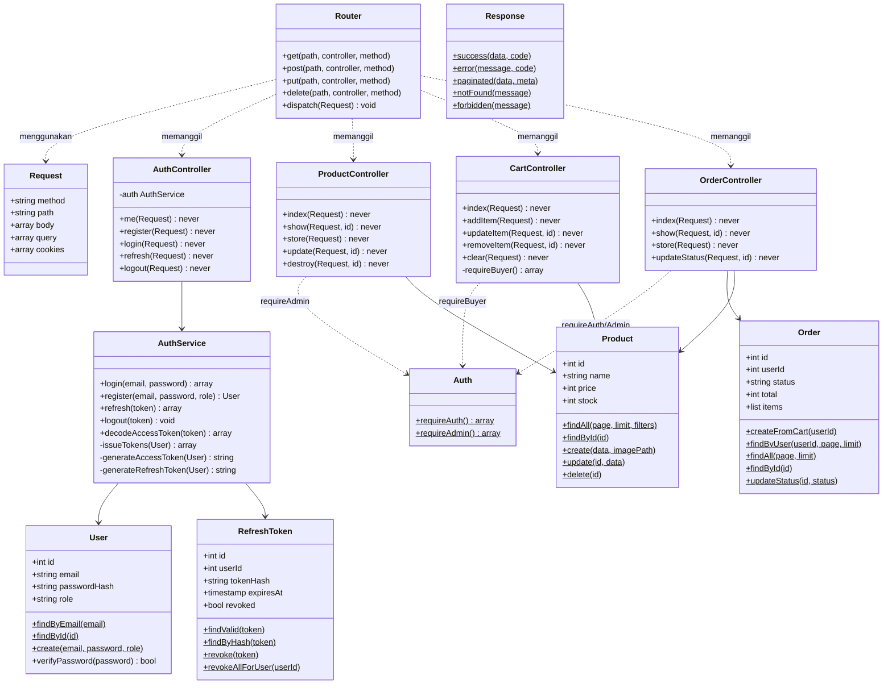

# Depo Waroeng Ban — Sistem E-Commerce Sederhana

Aplikasi e-commerce berbasis web untuk toko ban, dibuat sebagai tugas akhir mata kuliah Pemrograman Web Lanjut (UAS). Sistem mendukung dua peran pengguna: **Pembeli** dan **Penjual**.

---

## Arsitektur MVC

Proyek ini menerapkan pola **MVC (Model-View-Controller)** dalam bentuk **decoupled** — lapisan *View* dipisah ke aplikasi frontend yang berdiri sendiri, sementara lapisan *Model* dan *Controller* berada di backend PHP.



| Komponen MVC | Implementasi | Lokasi |
| --- | --- | --- |
| **Model** | Kelas PHP yang merepresentasikan entitas dan mengelola semua akses basis data via PDO | `api/src/Model/` |
| **View** | Komponen Vue 3 yang merender antarmuka dan mengelola interaksi pengguna | `frontend/src/` |
| **Controller** | Kelas PHP yang menerima permintaan HTTP, memanggil Model, dan mengembalikan respons JSON | `api/src/Controller/` |

Pendekatan ini dikenal sebagai **MVC berbasis API** (*API-driven MVC*) — pola yang umum digunakan pada aplikasi web modern di mana *View* berupa *Single Page Application* (SPA) yang berkomunikasi dengan *Controller* melalui REST API. Pemisahan ini tidak mengubah prinsip MVC, melainkan memperkuat pemisahan tanggung jawab (*separation of concerns*) karena setiap lapisan benar-benar independen.

---

## Tumpukan Teknologi

| Lapisan | Teknologi |
|---|---|
| Latar | PHP 8.3+, tanpa kerangka kerja — kernel HTTP buatan sendiri |
| Basis Data | PostgreSQL 17 (Docker) |
| Muka | Vue 3, Vite, TypeScript |
| Gaya Tampilan | TailwindCSS v4 |
| Manajemen Keadaan | Pinia, TanStack Query v5 |
| Autentikasi | JWT (token akses + token pembaruan) melalui kuki `HttpOnly` |
| Kontrak API | OpenAPI 3 → tipe TypeScript yang digenerate otomatis |

---

## Struktur Proyek

```
.
├── api/                    # Latar PHP
│   ├── public/
│   │   ├── index.php       # Titik masuk — mendaftarkan semua rute
│   │   └── uploads/        # Gambar produk yang diunggah
│   ├── src/
│   │   ├── Config/         # Pemuat variabel lingkungan
│   │   ├── Controller/     # Auth, Cart, Order, Product, Health
│   │   ├── DTO/            # Bentuk permintaan/respons beranotasi OpenAPI
│   │   ├── Http/           # Router, Request, Response, middleware Auth
│   │   ├── Model/          # User, RefreshToken, Product, Cart, Order
│   │   ├── Service/        # AuthService (penerbitan token, rotasi, deteksi ulang-pakai)
│   │   └── Validation/     # Validator (required, email, minLength, in)
│   ├── migrations/         # Berkas migrasi SQL berurutan
│   ├── migrate.php         # Pemroses migrasi
│   └── seed.php            # Pengisi data contoh
├── frontend/               # SPA Vue 3
│   └── src/
│       ├── components/     # Bersama: PublicHeader, AdminHeader
│       ├── features/       # auth, cart, orders, products (berbasis fitur)
│       ├── pages/admin/    # DashboardPage
│       ├── router/         # Vue Router dengan penjaga berbasis peran
│       ├── stores/         # Pinia: auth, jumlah item keranjang
│       └── types/          # api.generated.ts (digenerate dari OpenAPI)
├── docker-compose.yml      # PostgreSQL 17 + AdminNeo
├── openapi.json            # Spesifikasi API yang digenerate
└── package.json            # Skrip utama (dev, build, db:*, generate)
```

---

## Diagram

### Kasus Penggunaan



---

### Relasi Entitas (ERD)



---

### Diagram Urutan — Alur Autentikasi



---

### Diagram Alir — Siklus Hidup Permintaan API



---

### Diagram Kelas — Arsitektur Latar



---

## Memulai

### Prasyarat

- PHP 8.3+ dengan ekstensi `pdo_pgsql`
- Composer
- Node.js 20+ dan pnpm
- Docker (untuk PostgreSQL)

### 1. Pasang dependensi

```bash
# PHP
composer install --working-dir=api

# Node
pnpm install
```

### 2. Konfigurasi lingkungan

Buat berkas `.env` di **akar repositori**:

```env
# Basis data
DB_HOST=localhost
DB_PORT=6543
DB_NAME=pwl_uas
DB_USER=postgres
DB_PASSWORD=rahasia

# JWT
JWT_SECRET=ganti-dengan-string-acak-panjang
JWT_ACCESS_TTL=900        # 15 menit (dalam detik)
JWT_REFRESH_TTL=604800    # 7 hari (dalam detik)

# CORS — harus sama persis dengan asal muka
FRONTEND_URL=http://localhost:5173
```

### 3. Jalankan basis data

```bash
pnpm db:up       # menjalankan PostgreSQL 17 di :6543 dan AdminNeo di :6580
pnpm db:migrate  # menjalankan semua migrasi secara berurutan
pnpm db:seed     # (opsional) mengisi data produk contoh
```

### 4. Jalankan dalam mode pengembangan

```bash
pnpm dev
```

Perintah ini menjalankan kedua peladen secara bersamaan:
- API → `http://localhost:8000`
- Muka → `http://localhost:5173`

---

## Daftar Perintah

| Perintah | Keterangan |
|---|---|
| `pnpm dev` | Jalankan API + muka dalam mode pantau |
| `pnpm build` | Periksa tipe lalu bangun muka untuk produksi |
| `pnpm prod` | Bangun lalu sajikan keduanya dengan peladen bawaan PHP |
| `pnpm generate` | Regenerasi `openapi.json` + `api.generated.ts` dari anotasi PHP |
| `pnpm db:up` | Jalankan layanan Docker (Postgres + AdminNeo) |
| `pnpm db:down` | Hentikan layanan Docker |
| `pnpm db:reset` | Hapus volume dan mulai ulang (menghapus semua data) |
| `pnpm db:migrate` | Jalankan migrasi SQL yang belum diproses |
| `pnpm db:seed` | Isi data produk contoh |

---

## Titik Akhir API

Semua respons mengikuti amplop standar:

```jsonc
// Berhasil
{ "status": "success", "data": { ... } }

// Berhalaman
{ "status": "success", "data": [...], "pagination": { "total": 40, "per_page": 10, ... } }

// Galat
{ "status": "error", "message": "..." }
```

### Autentikasi

| Metode | Jalur | Autentikasi | Keterangan |
|---|---|---|---|
| `POST` | `/auth/register` | — | Daftar akun (peran: `user` atau `admin`) |
| `POST` | `/auth/login` | — | Masuk, menyetel kuki JWT |
| `POST` | `/auth/refresh` | kuki | Rotasi token pembaruan |
| `POST` | `/auth/logout` | kuki | Cabut token pembaruan, hapus kuki |
| `GET` | `/auth/me` | kuki | Informasi pengguna saat ini |

### Produk

| Metode | Jalur | Autentikasi | Keterangan |
|---|---|---|---|
| `GET` | `/products` | — | Daftar (berhalaman, dapat difilter) |
| `GET` | `/products/{id}` | — | Satu produk |
| `POST` | `/products` | admin | Tambah produk (`multipart/form-data` + gambar) |
| `PUT` | `/products/{id}` | admin | Perbarui produk |
| `DELETE` | `/products/{id}` | admin | Hapus produk |

Parameter kueri untuk `GET /products`: `page`, `limit`, `search`, `category`, `min_price`, `max_price`

### Keranjang

| Metode | Jalur | Autentikasi | Keterangan |
|---|---|---|---|
| `GET` | `/cart` | pembeli | Ambil keranjang beserta isinya |
| `POST` | `/cart/items` | pembeli | Tambah item `{ product_id, quantity }` |
| `PUT` | `/cart/items/{id}` | pembeli | Perbarui jumlah item |
| `DELETE` | `/cart/items/{id}` | pembeli | Hapus satu item |
| `DELETE` | `/cart` | pembeli | Kosongkan keranjang |

### Pesanan

| Metode | Jalur | Autentikasi | Keterangan |
|---|---|---|---|
| `POST` | `/orders` | pembeli | Buat pesanan dari keranjang |
| `GET` | `/orders` | semua | Pesanan sendiri (pembeli) / semua pesanan (admin) |
| `GET` | `/orders/{id}` | semua | Detail pesanan beserta item |
| `PUT` | `/orders/{id}/status` | admin | Perbarui status pesanan |

Status pesanan: `pending` → `processing` → `shipped` → `completed` / `cancelled`

---

## Kendali Akses

| Peran | Nilai | Hak Akses |
|---|---|---|
| Pembeli | `user` | Jelajah produk, kelola keranjang, buat dan lihat pesanan sendiri |
| Penjual | `admin` | Kelola produk, lihat semua pesanan, perbarui status pesanan |

Penjual diblokir dari jalur keranjang/kasir/pesanan di tiga lapisan:
1. **Penjaga rute** — meta `buyerOnly` mengalihkan admin ke `/admin`
2. **Antarmuka** — ikon keranjang, tautan "Pesanan", dan tombol "Tambah ke Keranjang" disembunyikan untuk admin
3. **API** — titik akhir keranjang dan pembuatan pesanan mengembalikan `403 Forbidden` untuk token admin

---

## Keamanan

- Kata sandi di-hash dengan **Argon2ID**
- JWT disimpan dalam kuki `HttpOnly; Secure; SameSite=Strict` — tidak pernah terekspos ke JavaScript
- **Rotasi token pembaruan** pada setiap pemanggilan `/auth/refresh`
- **Deteksi ulang-pakai** — jika token pembaruan yang sudah dicabut digunakan kembali, semua token milik pengguna tersebut langsung dicabut
- Pembatasan laju pada titik akhir autentikasi: 10 permintaan per menit per IP
- Semua kueri basis data menggunakan prepared statement PDO (tanpa rangkaian string SQL)
- CORS dibatasi ke `FRONTEND_URL` — tanpa karakter pengganti

---

## AdminNeo

Saat tumpukan Docker berjalan, AdminNeo tersedia di:

```
http://localhost:6580
```

Sambungkan menggunakan kredensial yang sama dari berkas `.env`, dengan `db` sebagai nama peladen.
